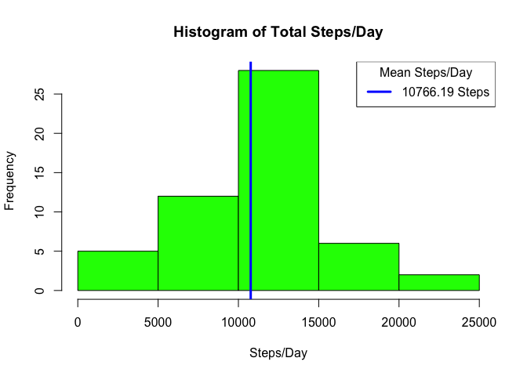
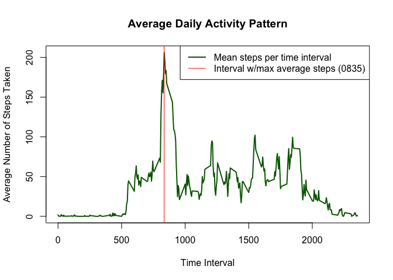
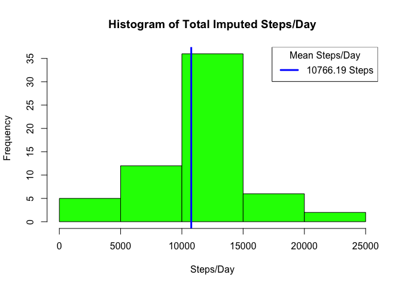
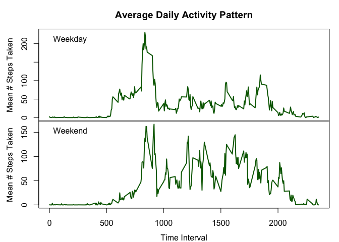

# Reproducible Research: Peer Assessment 1
Reginald Carey  
March 9, 2015  

## Loading and preprocessing the data

The data file for this project is already in the github repository.  All we need to do is load the data.

### Unzip the zip file containing the data, if not already unzipped


```r
## Load lubridate library, we will use it later on.
library(lubridate)

## unzip if its not already unzipped
if (!file.exists('activity.csv')) {
  unzip(zipfile = 'activity.zip')
}
```

At this point we should have a file `activity.csv` in the directory ready to be loaded.

```r
list.files(pattern = '*.csv')
```

```
## [1] "activity.csv"
```

### Load the csv file into memory

```r
## Load the data using read.csv.  We do not want any factors, there is a header, the separator
## is a comma and strings are surrounded by double quotes.
original <- read.csv('activity.csv', stringsAsFactors = FALSE, header = TRUE, sep = ',', quote = '"')
```

## What is mean total number of steps taken per day?

For this part of the assignment, you can ignore the missing values in the dataset.


```r
## make a version of the data that contains no missing values
activity <- original[complete.cases(original),]
```

1) Calculate the total number of steps taken per day

```r
## Total steps taken per day
totalStepsPerDay <- aggregate(steps~date, activity, sum)

## Total steps taken
sum(totalStepsPerDay$steps)
```

```
## [1] 570608
```

2) If you do not understand the difference between a histogram and a barplot, research 
the difference between them. Make a histogram of the total number of steps taken each day


```r
hist(
  totalStepsPerDay$steps, 
  xlab = "Steps/Day", 
  main = "Histogram of Total Steps/Day", 
  col = "green")

meanSteps <- mean(totalStepsPerDay$steps)
medianSteps <- median(totalStepsPerDay[order(totalStepsPerDay$steps),]$steps)

## We put the mean on the histogram!
abline(v = meanSteps, lwd = 3, col = "blue")

## We do NOT put the median on the histogram. The values are too close

legend("topright", 
       title = "Mean Steps/Day",
       sprintf("%5.2f Steps", meanSteps),
       col = "blue", 
       lty = 1, 
       lwd = 3)
```

 

3) Calculate and report the mean and median of the total number of steps taken per day


```r
print(meanSteps)
```

```
## [1] 10766.19
```

```r
print(medianSteps)
```

```
## [1] 10765
```

## What is the average daily activity pattern?

1) Make a time series plot (i.e. `type = "l"`) of the 5-minute interval (x-axis) and the average 
number of steps taken, averaged across all days (y-axis)


```r
timeSeries <- aggregate(steps~interval, activity, mean)
maxInterval <- timeSeries$interval[which.max(timeSeries$steps)]

plot(
  timeSeries$interval,
  timeSeries$steps, 
  type = "l",
  xlab = "Time Interval",
  ylab = "Average Number of Steps Taken",
  main = "Average Daily Activity Pattern",
  col = "darkgreen",
  lwd = 2)

abline(v = maxInterval, col="red", lwd=1)

legend("topright", 
       legend=c(
         "Mean steps per time interval",
         sprintf("Interval w/max average steps (%04s)",maxInterval)),
       col=c("darkgreen","red"),
       lty=c(1,1),
       lwd=c(2,1)
       )
```

 

2) Which 5-minute interval, on average across all the days in the dataset, contains the maximum number of steps?


```r
sprintf("Interval containing maximum mean number of steps is %04s",maxInterval)
```

```
## [1] "Interval containing maximum mean number of steps is 0835"
```

## Imputing missing values

Note that there are a number of days/intervals where there are missing values (coded as NA). 
The presence of missing days may introduce bias into some calculations or summaries of the data.

1) Calculate and report the total number of missing values in the dataset (i.e. the total number of rows with NAs)


```r
## Calculate the total number of NA's in the data set
numberOfMissingValues = sum(is.na(original))
print(numberOfMissingValues)
```

```
## [1] 2304
```

```r
## Calculate the total number of rows containing NA's in the data set
numberOfRowsWithMissingValues = sum(!complete.cases(original))
print(numberOfRowsWithMissingValues)
```

```
## [1] 2304
```


2) Devise a strategy for filling in all of the missing values in the dataset. The strategy does not need to be 
sophisticated. For example, you could use the mean/median for that day, or the mean for that 5-minute interval, etc.

3) Create a new dataset that is equal to the original dataset but with the missing data filled in.


```r
## Make a copy of the original dataset
imputed <- original

## Impute missing data with mean steps for that 5 minute interval
for (i in 1:nrow(imputed)) {
  if (!complete.cases(imputed[i,])) {
    imputed[i,'steps'] = timeSeries[which.max(timeSeries$interval == imputed[i,'interval']),'steps']
  }
}
```


```r
## Calculate the total number of NA's in the imputed data set
numberOfMissingValues = sum(is.na(imputed))
print(numberOfMissingValues)
```

```
## [1] 0
```

```r
## Calculate the total number of rows containing NA's in the imputed data set
numberOfRowsWithMissingValues = sum(!complete.cases(imputed))
print(numberOfRowsWithMissingValues)
```

```
## [1] 0
```

4) Make a histogram of the total number of steps taken each day and Calculate and report the mean and 
median total number of steps taken per day. Do these values differ from the estimates from the first 
part of the assignment? What is the impact of imputing missing data on the estimates of the total 
daily number of steps?


```r
totalStepsPerDay <- aggregate(steps~date, imputed, sum)

## Total steps taken
sum(totalStepsPerDay$steps)
```

```
## [1] 656737.5
```

```r
hist(
  totalStepsPerDay$steps, 
  xlab = "Steps/Day", 
  main = "Histogram of Total Imputed Steps/Day", 
  col = "green")

meanImputedSteps <- mean(totalStepsPerDay$steps)
medianImputedSteps <- median(totalStepsPerDay[order(totalStepsPerDay$steps),]$steps)

## We put the mean on the histogram!
abline(v = meanImputedSteps, lwd = 3, col = "blue")

## We do NOT put the median on the histogram. The values are too close

legend("topright", 
       title = "Mean Steps/Day",
       sprintf("%5.2f Steps", meanImputedSteps),
       col = "blue", 
       lty = 1, 
       lwd = 3)
```

 

```r
## Calculate and report the mean of the total number of steps taken per day
sprintf("Original meanSteps is %f.  Imputed meanSteps is %f",
        meanSteps, meanImputedSteps)
```

```
## [1] "Original meanSteps is 10766.188679.  Imputed meanSteps is 10766.188679"
```

```r
## Calculate and report the median of the total number of steps taken per day
sprintf("Original medianSteps is %f.  Imputed medianSteps is %f", 
        medianSteps, medianImputedSteps)
```

```
## [1] "Original medianSteps is 10765.000000.  Imputed medianSteps is 10766.188679"
```

The mean steps did not vary (based on using values from the summary() function) between the original
dataset (with missing values) and the imputed dataset.

The median steps did vary.  Median is the middle entry in an ordered list so it is likely to have
changed considering there are more numbers to work with.

## Are there differences in activity patterns between weekdays and weekends?

For this part the weekdays() function may be of some help here. Use the dataset with the filled-in missing values for this part.


```r
library(lubridate)
```

1) Create a new factor variable in the dataset with two levels – “weekday” and “weekend” 
indicating whether a given date is a weekday or weekend day.


```r
imputed$dayType = factor(is.element(wday(ymd(imputed$date)), c(1, 7)), 
                         labels=c("weekday","weekend"))
levels(imputed$dayType)
```

```
## [1] "weekday" "weekend"
```

2) Make a panel plot containing a time series plot (i.e. type = "l") of the 5-minute interval 
(x-axis) and the average number of steps taken, averaged across all weekday days or weekend 
days (y-axis). See the README file in the GitHub repository to see an example of what this 
plot should look like using simulated data.


```r
par(mfrow=c(2,1))

timeSeries <- aggregate(steps~interval, subset(imputed, dayType == "weekday"), mean)

par(mar=c(0,4,3,1))
plot(
  timeSeries$interval,
  timeSeries$steps, 
  type = "l",
  xlab = NA,
  ylab = NA,
  xaxt = "n",
  col = "darkgreen",
  lwd = 2)
legend("topleft", "Weekday", bty = "n")
mtext(side = 2, "Mean # Steps Taken", line = 2.5)
title("Average Daily Activity Pattern")

timeSeries <- aggregate(steps~interval, subset(imputed, dayType == "weekend"), mean)

par(mar=c(3.5,4,0,1))
plot(
  timeSeries$interval,
  timeSeries$steps, 
  type = "l",
  xlab = NA,
  ylab = NA,
  col = "darkgreen",
  lwd = 2)
legend("topleft", "Weekend", bty = "n")
mtext(side = 2, "Mean # Steps Taken", line = 2.5)

mtext(side = 1, "Time Interval", line = 2.5)
```

 
